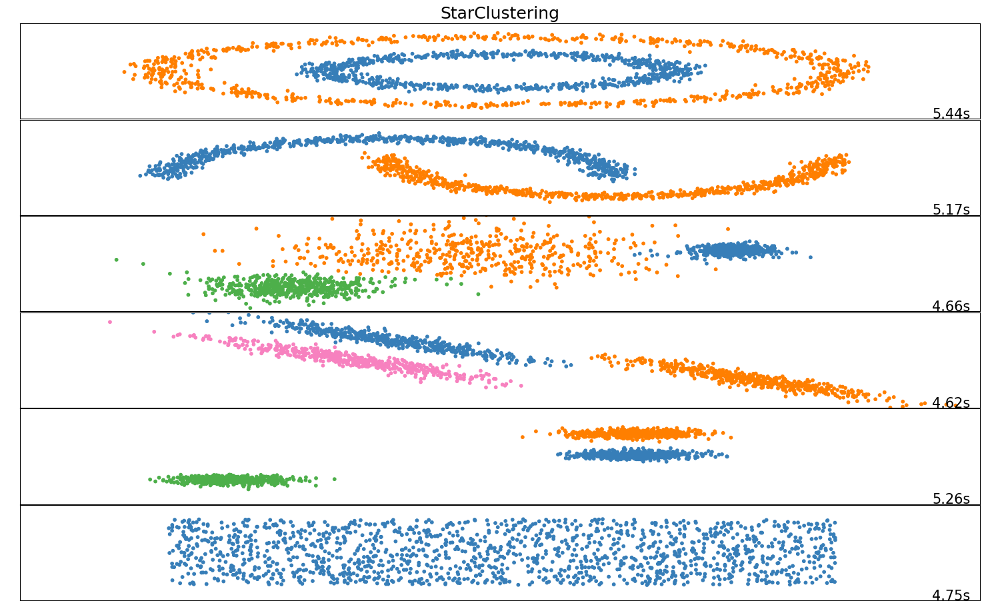
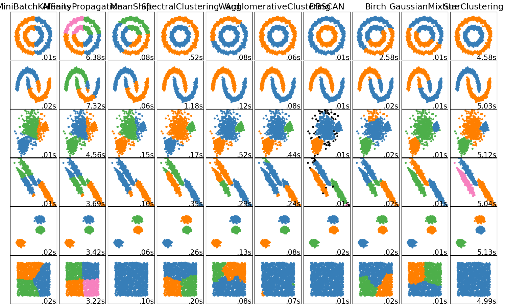
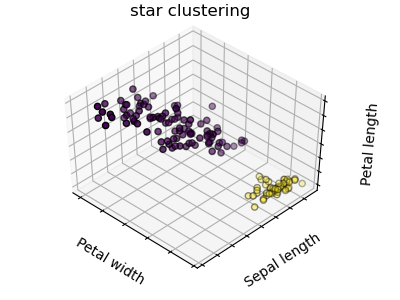
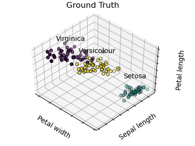

# Star Clustering

## Introduction

The Star Clustering algorithm is a clustering technique that is loosely inspired and analogous to the process of star system formation.  Its purpose is as an alternative clustering algorithm that does not require knowing the number of clusters in advance or any hyperparameter tuning.

## Installation

The following dependencies should be installed:

* numpy

## Setup

It is recommended that you have Scikit-Learn as the implementation provided here is meant to work with Scikit-Learn as a drop in replacement for other algorithms.

The actual algorithm is located in star_clustering.py and can be called by the import statement:

`from star_clustering import StarCluster`

Then create an object to instantiate an instance of the algorithm:

`star = StarCluster()`

Then call the fit or predict functions as you would any other clustering algorithm in Scikit-Learn.

## Test Scripts

Three test scripts are provided that are meant to show the effectiveness of the algorithm on very different types of data.

* plot_cluster_comparison.py
* word_vectors_test.py
* plot_cluster_iris.py

Note that the word vectors test requires a copy of the FastText pretrained word vectors or some equivalent, which is not provided here.

## Example Plot Results

### Performance On Various Synthetic Test Data

### Comparison To Other Algorithms

### Performance On Iris Data

### Iris Data Ground Truth

## High-Dimensional Clustering Focused Updates

* angular distance metric added (see https://en.wikipedia.org/wiki/Cosine_similarity#Angular_distance_and_similarity)
* distance calculations moved to classes in distances.py to enable switching via method argument and future distance metric additions
* optional centering of data rows and columns added to distance metrics
* optional limit_exp argument added to the StarCluster.fit() method to allow for scaling of the constant used in calculating the limit value
* optional upper threshold added that prevents connections from being made to nodes above a certain mass added in an attempt to (very) roughly emulate golden section search
* new features were (hopefully) added in a way that everything should work identically to the original code if default arguments are sent to the Starcluster.fit() method
* **basic_english_upper_angular_centered_lim0p618.txt** contains results of word clustering with arguments of fit(vectors, upper=True, limit_exp=-1, dis_type='angular')

## License

Apache 2.0